<picture>
  <source media="(prefers-color-scheme: dark)" srcset="docs/assets/readme/hero-en-dark.svg">
  
</picture>

<p align="center">
  <a href="README.pt-BR.md">Português</a> ·
  <a href="#quick-start">Quick start</a> ·
  <a href="#claude-code-plugin">Claude Code plugin</a> ·
  <a href="#how-it-fits-together">How it works</a> ·
  <a href="#roadmap">Roadmap</a> ·
  <a href="CONTRIBUTING.md">Contributing</a>
</p>

**tripaulx-builder-init** is the open-source base from which every tripaulx-builders
project starts. It has two parts:

- **[`sdk/`](sdk)** is **tripaulx-sdk**, a Python package of reusable Django apps;
- **[`template/`](template)** is a **[Copier](https://copier.readthedocs.io) template** that creates a new project wired to the SDK.

Each **workspace** gets its own PostgreSQL schema and is served at
`<slug>.<your-domain>`. Projects are backend only (a DRF API and the Django admin)
and deploy to CapRover.

> [!NOTE]
> **0.1.0 is out** on [PyPI](https://pypi.org/project/tripaulx-sdk/)
> (`uv add "tripaulx-sdk[storage,ai]"`). Every app below is implemented, tested
> (Python 3.12/3.13 × Django 6.0/6.1 × PostgreSQL 16/17) and translated to pt-BR.
> The template deploys to CapRover.

## Quick start

Requirements: [uv](https://docs.astral.sh/uv/) and PostgreSQL 16+.

```bash
uvx copier copy --trust gh:tripaulx/tripaulx-builder-init my-project
cd my-project
./start            # .env.local, database, migrations, first workspace, :8000
```

Then open `http://main.my-project.localhost:8000/admin/`. Any `*.localhost` name
resolves to your machine, so every workspace works locally with no hosts file.

## Claude Code plugin

Install the **tripaulx-builder** plugin and let Claude create or update projects for you:

```bash
claude plugin marketplace add tripaulx/tripaulx-builder-init
claude plugin install tripaulx-builder@tripaulx
```

Inside Claude Code you can also run `/plugin marketplace add tripaulx/tripaulx-builder-init`
and then `/plugin install tripaulx-builder@tripaulx`.

| Skill | What it does |
|---|---|
| `/tripaulx-builder:new-project [name]` | Checks prerequisites, asks for the answers, runs the Copier template, sets up the database and keys, runs the tests and hands over next steps. |
| `/tripaulx-builder:update-project [tag]` | `copier update` + `uv lock --upgrade-package tripaulx-sdk`, migrations and tests, with a summary of what changed. |

Claude also uses them on its own when you ask, for example, "start a new tripaulx project
called Acme".

## How it fits together

<picture>
  <source media="(prefers-color-scheme: dark)" srcset="docs/assets/readme/architecture-en-dark.svg">
  
</picture>

- **What every project shares lives in the SDK.** A fix there reaches every project with `uv lock --upgrade-package tripaulx-sdk`.
- **What each project owns comes from the template.** That covers settings, the `User` model, scripts and CI. Template improvements arrive with `copier update`.
- **Your business logic lives only in your project's apps.** Nobody forks the SDK. Projects extend it through the `TRIPAULX` settings dict, registries, signals and overridable templates.

## How a request finds its workspace

<picture>
  <source media="(prefers-color-scheme: dark)" srcset="docs/assets/readme/request-flow-en-dark.svg">
  
</picture>

1. The **subdomain is the workspace slug**. A wildcard DNS record and a Cloudflare Origin CA certificate cover `*.example.com`, so a new workspace needs no DNS or certificate change.
2. CapRover's nginx answers `server_name *.example.com` and forwards to the container.
3. `tripaulx.core.middleware.TenantMiddleware` answers `/healthz` and `/readyz` **before** any tenant lookup. Container probes use internal hosts that would never match a workspace.
4. django-tenants maps the host to a `Domain` and sets `search_path` to that workspace's schema. Every query is then isolated. **An unknown host gets a 404**, never the public site.

## What's inside the SDK

<picture>
  <source media="(prefers-color-scheme: dark)" srcset="docs/assets/readme/sdk-apps-en-dark.svg">
  
</picture>

| App | Django label | Ready | Responsibility |
|---|---|---|---|
| `tripaulx.core` | `tpsdk_core` | ✅ | `BaseModel` (UUID, audit timestamps, soft delete), tenant middleware, log redaction, test helpers |
| `tripaulx.tenants` | `tpsdk_tenants` | ✅ | `Workspace` and `Domain`, slug rules with reserved names, `bootstrap_workspace` |
| `tripaulx.accounts` | `tpsdk_accounts` | ✅ | Sign-up that creates a workspace, mandatory 2FA, TOTP, passkeys, recovery codes, trusted devices, members and invitations, schema-bound JWT |
| `tripaulx.settings` | n/a | ✅ | App lists, middleware, logging, hosts and `.env` loading for your settings |
| `tripaulx.mail` | `tpsdk_mail` | ✅ | Mailgun backend with an encrypted key, overridable e-mail templates |
| `tripaulx.storage` | `tpsdk_storage` | ✅ | S3-compatible storage, AES-GCM envelope encryption, per-workspace keys |
| `tripaulx.ai` | `tpsdk_ai` | ✅ | OpenAI and Anthropic, agents, skills, cost tracking and daily caps |
| `tripaulx.legal` | `tpsdk_legal` | ✅ | Governance documents, terms and privacy, sanitized Markdown |

## Accounts and 2-step verification

<picture>
  <source media="(prefers-color-scheme: dark)" srcset="docs/assets/readme/auth-flow-en-dark.svg">
  
</picture>

- **Sign-up creates the workspace:** its schema, its subdomain and its owner.
- **2-step verification is always on.** The second step uses the authenticator app (TOTP) when the user turned it on, otherwise a 6-digit e-mail code. Recovery codes are the backup.
- **Passkeys** (WebAuthn) sign in without a password. *Passkey-only* mode turns off password login while at least one passkey exists.
- **Tokens are bound to their workspace schema.** A token issued for `acme` is rejected by every other workspace.

## Documentation

| Guide | English | Português |
|---|---|---|
| Accounts, 2FA and passkeys | [accounts](docs/accounts.md) | [contas](docs/pt-BR/accounts.md) |
| Encrypted storage | [storage](docs/storage.md) | [storage](docs/pt-BR/storage.md) |
| AI providers and agents | [ai](docs/ai.md) | [ia](docs/pt-BR/ai.md) |
| Legal and governance | [legal](docs/legal.md) | [legal](docs/pt-BR/legal.md) |
| Deploy to CapRover | [deployment](docs/deployment.md) | [deploy](docs/pt-BR/deployment.md) |

## Roadmap

<picture>
  <source media="(prefers-color-scheme: dark)" srcset="docs/assets/readme/roadmap-en-dark.svg">
  
</picture>

## Develop this repository

```bash
uv sync
cd sdk && uv run pytest              # SDK tests (needs local PostgreSQL)
cd .. && scripts/render_example.sh   # render template/ into example/ (gitignored)
cd example && ./start setup && ./start test
```

The diagrams above are generated in the tripaulx design system. To change one, edit
its copy in `scripts/readme_art/copy/*.toml` or its drawing in
`scripts/readme_art/diagrams/`, then run:

```bash
uv run --group docs python -m scripts.readme_art
```

Code standards are in [`CLAUDE.md`](CLAUDE.md). The contributing guide is in
[`CONTRIBUTING.md`](CONTRIBUTING.md).

## Maintainer

Created and maintained by **Flavio Almeida Paulino**
([f1@tripaulx.com](mailto:f1@tripaulx.com?subject=%5Btripaulx-builder-init%5D)).

## License

Code: [MIT](LICENSE). The diagrams embed the [Inter](https://rsms.me/inter/) typeface,
under the [SIL Open Font License](scripts/readme_art/fonts/OFL.txt). The tripaulx name
and logo are trademarks of Tripaulx and are not covered by the MIT license.

<br>
<p align="center">
  <picture>
    <source media="(prefers-color-scheme: dark)" srcset="docs/assets/readme/logo-dark.svg">
    
  </picture>
</p>
