<picture>
  <source media="(prefers-color-scheme: dark)" srcset="docs/assets/readme/hero-pt-dark.svg">
  
</picture>

<p align="center">
  <a href="README.md">English</a> ·
  <a href="#início-rápido">Início rápido</a> ·
  <a href="#plugin-do-claude-code">Plugin do Claude Code</a> ·
  <a href="#como-as-partes-se-encaixam">Como funciona</a> ·
  <a href="#roadmap">Roadmap</a> ·
  <a href="CONTRIBUTING.md">Contribuir</a>
</p>

O **tripaulx-builder-init** é a base open source de onde nasce todo projeto
tripaulx-builders. Ele tem duas partes:

- **[`sdk/`](sdk)** é o **tripaulx-sdk**, um pacote Python com apps Django reutilizáveis;
- **[`template/`](template)** é um **template [Copier](https://copier.readthedocs.io)** que cria um projeto novo já ligado ao SDK.

Cada **workspace** tem seu próprio schema PostgreSQL e é servido em
`<slug>.<seu-dominio>`. Os projetos são só backend (API DRF e admin do Django) e
fazem deploy no CapRover.

> [!NOTE]
> **O 0.1.0 foi lançado** no [PyPI](https://pypi.org/project/tripaulx-sdk/)
> (`uv add "tripaulx-sdk[storage,ai]"`). Todos os apps abaixo estão implementados,
> testados (Python 3.12/3.13 × Django 6.0/6.1 × PostgreSQL 16/17) e traduzidos para
> pt-BR. O template faz deploy no CapRover.

## Início rápido

Requisitos: [uv](https://docs.astral.sh/uv/) e PostgreSQL 16+.

```bash
uvx copier copy --trust gh:tripaulx/tripaulx-builder-init meu-projeto
cd meu-projeto
./start            # .env.local, banco, migrations, primeiro workspace, :8000
```

Depois abra `http://main.meu-projeto.localhost:8000/admin/`. Qualquer nome
`*.localhost` aponta para a sua máquina, então todo workspace funciona localmente sem
editar o arquivo hosts.

## Plugin do Claude Code

Instale o plugin **tripaulx-builder** e deixe o Claude criar ou atualizar projetos para você:

```bash
claude plugin marketplace add tripaulx/tripaulx-builder-init
claude plugin install tripaulx-builder@tripaulx
```

Dentro do Claude Code também dá para usar `/plugin marketplace add tripaulx/tripaulx-builder-init`
e depois `/plugin install tripaulx-builder@tripaulx`.

| Skill | O que faz |
|---|---|
| `/tripaulx-builder:new-project [nome]` | Confere os pré-requisitos, pergunta as respostas, roda o template Copier, prepara banco e chaves, roda os testes e explica os próximos passos. |
| `/tripaulx-builder:update-project [tag]` | `copier update` + `uv lock --upgrade-package tripaulx-sdk`, migrations e testes, com um resumo do que mudou. |

O Claude também as usa sozinho quando você pede, por exemplo, "crie um projeto tripaulx
novo chamado Acme".

## Como as partes se encaixam

<picture>
  <source media="(prefers-color-scheme: dark)" srcset="docs/assets/readme/architecture-pt-dark.svg">
  
</picture>

- **O que todo projeto compartilha fica no SDK.** Uma correção ali chega a todos os projetos com `uv lock --upgrade-package tripaulx-sdk`.
- **O que é de cada projeto vem do template.** Isso inclui settings, o modelo `User`, scripts e CI. As melhorias do template chegam com `copier update`.
- **A regra de negócio fica só nos apps do seu projeto.** Ninguém faz fork do SDK. Os projetos o estendem pelo dict `TRIPAULX` das settings, por registros, signals e templates sobrescrevíveis.

## Como uma requisição encontra seu workspace

<picture>
  <source media="(prefers-color-scheme: dark)" srcset="docs/assets/readme/request-flow-pt-dark.svg">
  
</picture>

1. O **subdomínio é o slug do workspace**. Um registro DNS wildcard e um certificado Cloudflare Origin CA cobrem `*.example.com`, então um workspace novo não exige mudança de DNS nem de certificado.
2. O nginx do CapRover atende `server_name *.example.com` e repassa ao container.
3. O `tripaulx.core.middleware.TenantMiddleware` responde `/healthz` e `/readyz` **antes** de buscar o tenant. As probes do container usam hosts internos, que nunca casariam com um workspace.
4. O django-tenants associa o host a um `Domain` e aponta o `search_path` para o schema daquele workspace. A partir daí toda consulta fica isolada. **Host desconhecido recebe 404**, nunca o site público.

## O que há dentro do SDK

<picture>
  <source media="(prefers-color-scheme: dark)" srcset="docs/assets/readme/sdk-apps-pt-dark.svg">
  
</picture>

| App | Label Django | Pronto | Responsabilidade |
|---|---|---|---|
| `tripaulx.core` | `tpsdk_core` | ✅ | `BaseModel` (UUID, datas de auditoria, exclusão lógica), middleware de tenant, mascaramento de logs, helpers de teste |
| `tripaulx.tenants` | `tpsdk_tenants` | ✅ | `Workspace` e `Domain`, regras de slug com nomes reservados, `bootstrap_workspace` |
| `tripaulx.accounts` | `tpsdk_accounts` | ✅ | Cadastro que cria o workspace, 2FA obrigatório, TOTP, passkeys, códigos de recuperação, dispositivos confiáveis, membros e convites, JWT preso ao schema |
| `tripaulx.settings` | n/a | ✅ | Listas de apps, middleware, logging, hosts e carga do `.env` para as suas settings |
| `tripaulx.mail` | `tpsdk_mail` | ✅ | Backend Mailgun com chave cifrada, templates de e-mail sobrescrevíveis |
| `tripaulx.storage` | `tpsdk_storage` | ✅ | Storage compatível com S3, cifra envelope AES-GCM, chaves por workspace |
| `tripaulx.ai` | `tpsdk_ai` | ✅ | OpenAI e Anthropic, agentes, skills, custos e teto diário |
| `tripaulx.legal` | `tpsdk_legal` | ✅ | Documentos de governança, termos e privacidade, Markdown sanitizado |

## Contas e verificação em duas etapas

<picture>
  <source media="(prefers-color-scheme: dark)" srcset="docs/assets/readme/auth-flow-pt-dark.svg">
  
</picture>

- **O cadastro cria o workspace:** o schema, o subdomínio e o dono.
- **A verificação em duas etapas é sempre ativa.** A segunda etapa usa o aplicativo autenticador (TOTP) quando o usuário o ativou; senão, um código de 6 dígitos por e-mail. Os códigos de recuperação são a reserva.
- **Passkeys** (WebAuthn) entram sem senha. O modo *somente passkey* desliga o login por senha enquanto houver ao menos uma passkey.
- **Os tokens ficam presos ao schema do workspace.** Um token emitido para `acme` é recusado por qualquer outro workspace.

## Documentação

| Guia | Português | English |
|---|---|---|
| Contas, 2FA e passkeys | [contas](docs/pt-BR/accounts.md) | [accounts](docs/accounts.md) |
| Storage cifrado | [storage](docs/pt-BR/storage.md) | [storage](docs/storage.md) |
| Provedores de IA e agentes | [ia](docs/pt-BR/ai.md) | [ai](docs/ai.md) |
| Legal e governança | [legal](docs/pt-BR/legal.md) | [legal](docs/legal.md) |
| Deploy no CapRover | [deploy](docs/pt-BR/deployment.md) | [deployment](docs/deployment.md) |

## Roadmap

<picture>
  <source media="(prefers-color-scheme: dark)" srcset="docs/assets/readme/roadmap-pt-dark.svg">
  
</picture>

## Desenvolver este repositório

```bash
uv sync
cd sdk && uv run pytest              # testes do SDK (precisa de PostgreSQL local)
cd .. && scripts/render_example.sh   # renderiza template/ em example/ (ignorado pelo git)
cd example && ./start setup && ./start test
```

Os diagramas acima são gerados no design system da tripaulx. Para mudar um deles, edite
o texto em `scripts/readme_art/copy/*.toml` ou o desenho em
`scripts/readme_art/diagrams/` e rode:

```bash
uv run --group docs python -m scripts.readme_art
```

Os padrões de código estão em [`CLAUDE.md`](CLAUDE.md). O guia de contribuição está em
[`CONTRIBUTING.md`](CONTRIBUTING.md).

## Mantenedor

Criado e mantido por **Flavio Almeida Paulino**
([f1@tripaulx.com](mailto:f1@tripaulx.com?subject=%5Btripaulx-builder-init%5D)).

## Licença

Código: [MIT](LICENSE). Os diagramas embutem a fonte [Inter](https://rsms.me/inter/),
sob a [SIL Open Font License](scripts/readme_art/fonts/OFL.txt). O nome e o logotipo
tripaulx são marcas da Tripaulx e não estão cobertos pela licença MIT.

<br>
<p align="center">
  <picture>
    <source media="(prefers-color-scheme: dark)" srcset="docs/assets/readme/logo-dark.svg">
    
  </picture>
</p>
